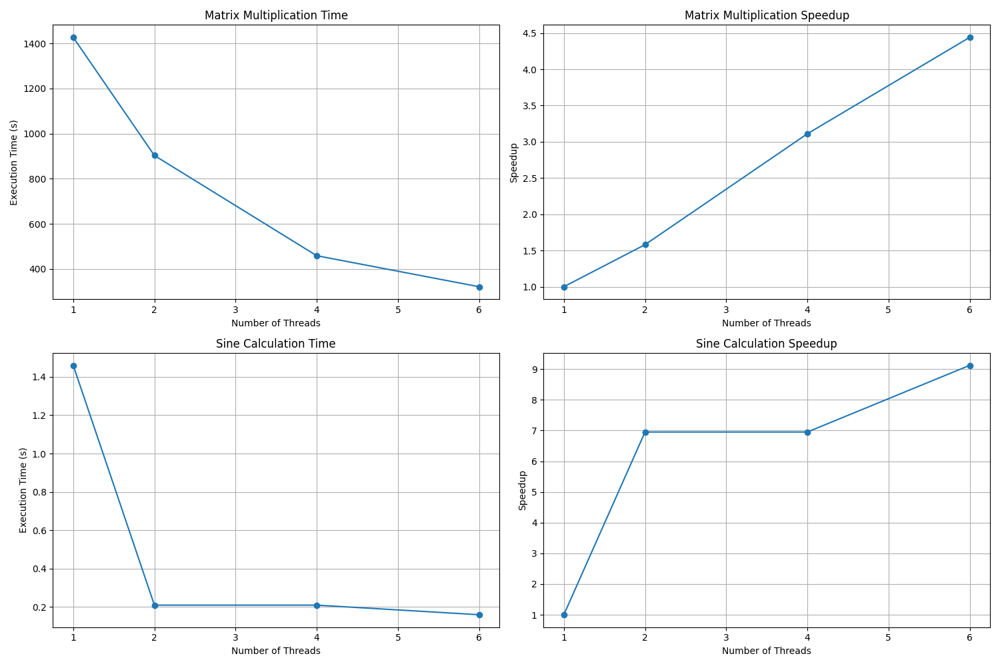

# 作业1报告

ZY2406320-肖志林

## 实验目的

本实验旨在通过实现矩阵乘法和正弦函数计算两个典型案例，探索OpenMP并行编程的性能优势。通过对比不同线程数下的执行时间和加速比，深入理解并行计算的效果和特点。

## 实验环境与方法

### 实验环境
- 编程语言：C语言
- 并行框架：OpenMP
- 矩阵规模：8000 × 8000
- 测试线程数：1, 2, 4, 6
- 编译工具：gcc
- 操作系统：Ubuntu 22.04
- 机器核心数量：6

### 实验内容
1. 矩阵乘法计算
   - 实现8000×8000矩阵的串行和并行乘法运算，并且进行缓存优化。
   
   

   - 使用OpenMP指令进行并行化优化
   - 测试不同线程数下的性能表现
   
   
   
2. 正弦函数计算
   - 使用泰勒级数实现sin(x)的计算，定义项数为$10^7$，预处理阶乘数组。
   - 应用OpenMP并行化计算过程
   - 对比不同线程数的计算效率
   
   

## 实验结果与分析

### 1. 矩阵乘法测试结果

| 线程数 | 执行时间(秒) | 加速比 |
|--------|-------------|--------|
| 1      | 1426.70     | 1.00   |
| 2      | 902.92      | 1.58   |
| 4      | 458.70      | 3.11   |
| 6      | 321.26      | 4.44   |

分析：
- 随着线程数的增加，执行时间显著降低
- 在6线程时达到最佳性能，相比串行版本提速4.44倍
- 加速比的增长趋势略低于线程数的增长，这是可能有一下原因：
  1. 线程间的同步开销
  2. 数据访问冲突和缓存一致性维护的开销
  3. 任务分配的额外开销

### 2. 正弦函数计算测试结果

| 线程数 | 执行时间(秒) | 加速比 |
|--------|-------------|--------|
| 1      | 1.46        | 1.00   |
| 2      | 0.21        | 6.95   |
| 4      | 0.21        | 6.95   |
| 6      | 0.16        | 9.12   |

在实现的过程中，由于存在阶乘的计算，所以预先处理出了阶乘表，避免了阶乘的重复计算。

同时由于阶乘的预处理复杂度为 $O(n)$，所以即使进行了加速，最后也会到达 $O(n)$ 的瓶颈。

分析：
- 正弦函数计算的并行效果显著优于矩阵乘法
- 2线程和4线程时都达到了6.95倍的加速比
- 6线程时达到最高9.12倍的加速比
- 性能优势明显的原因：计算过程独立，线程间几乎无数据依赖

## 结论

1. OpenMP能有效提升计算密集型任务的性能
2. 任务的并行特性显著影响加速效果：
   - 正弦函数计算这类独立性强的任务能获得接近线性的加速比
   - 矩阵乘法由于数据依赖和访存特性，加速效果相对较低
3. 增加线程数能提升性能，但提升效果会受到任务特性和硬件资源的限制